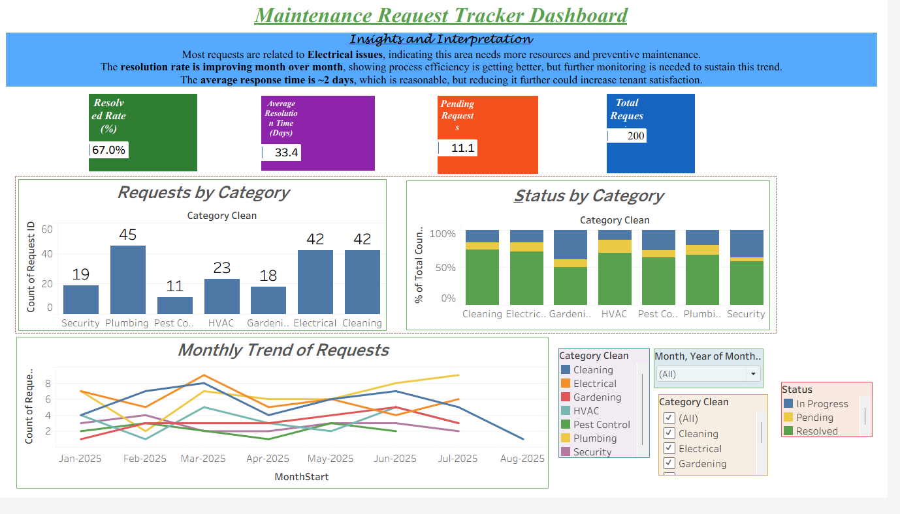

# 🛠️ Maintenance Request Tracker
A Tableau dashboard and dataset to monitor housing community maintenance requests, track categories, resolution time, and status.

This project is a **Tableau dashboard** built using an Excel dataset of service requests.  
It helps track request volumes, resolution timelines, and categories of issues.
This project tracks incoming service requests, their types, response times, and resolution status.
This project shows a live tracker showing request types, progress status, and response effectiveness.

---

## 📂 Files in this Repository
- `maintenance_requests_clean_v2.xlsx` → Raw dataset used in Tableau.
- `Maintenance_Request_Tracker_Dashboard.twbx` → Tableau packaged workbook (dashboard).
- `Dashboard.png` → Screenshot preview of the dashboard.

---

## 📊 Dashboard Features  
- 📈 **Monthly Trend of Requests** → Track service requests over time with a clean line/bar chart.  
- 🏷️ **Category-Wise Breakdown** → Understand which areas (Plumbing, Electrical, Cleaning, etc.) have the most requests.  
- 🔑 **KPI Cards with Modern Look** →  
  - **Total Requests** → Overall count of requests.  
  - **Pending Requests** → Number of unresolved requests.  
  - **Completed Requests** → Number of resolved requests.  
  - *Styled with white text and soft shadows for a modern professional appearance.*  
- 🎛️ **Interactive Filters** → Slice data by *Month* and *Category* to focus on specific insights.  

---

## 🚀 How to Use
You have **two options** to explore the dashboard:

### 🔹 Option 1: Download & Open in Tableau
1. Download `Maintenance_Tracker_Dashboard.twbx` from this repository.  
2. Open it in **Tableau Public/Desktop**.  
3. Connect to the provided Excel dataset (`maintenance_requests_clean_v2.xlsx`) if needed.  
4. Explore the interactive dashboard on your system.  

### 🔹 Option 2: View the Live Interactive Dashboard (Recommended 🎯)
Skip the download! Simply view and interact with the dashboard directly on Tableau Public:  
👉 [Live Dashboard on Tableau Public](https://public.tableau.com/app/profile/shreya.sah1178/viz/Maintenance_Request_Tracker_Dashboard/Maintenance_Request_Tracker_Dashboard?publish=yes)

---

## 🔗 Live Dashboard  
You can view the interactive dashboard directly on **Tableau Public** here:  
👉 [Click to View Dashboard](https://public.tableau.com/app/profile/shreya.sah1178/viz/Maintenance_Request_Tracker_Dashboard/Maintenance_Request_Tracker_Dashboard?publish=yes)  

---

## 📸 Dashboard Preview

---

## ✅ Tools Used
- **Excel** (dataset preparation)
- **Tableau** (dashboard creation)
- **GitHub** (project hosting)

---

## 🌟 Key Highlights  
- Clean, user-friendly interface with modern design elements.  
- KPI cards that give quick insights at a glance.  
- Fully interactive dashboard with filters for flexibility.  
- Helps housing community managers make **data-driven decisions** on maintenance priorities.  

---

## 📌 Author
Created by **Shreya Sah**

